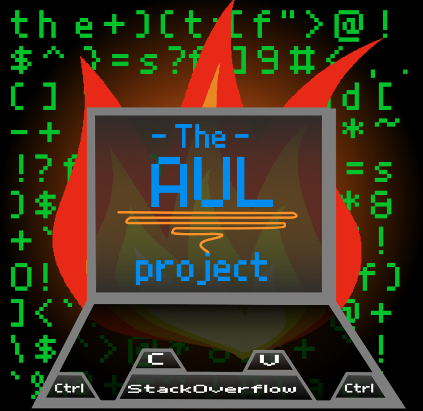

# Introduction
Annoyingly Uncodeable Language (AUL), officially The Annoyingly Uncodeable Language Project, is an [esoteric programming language](https://en.wikipedia.org/wiki/Esoteric_programming_language) developed by [Andrew Chen](https://github.com/actiniumn404) that aims to be so hard to code that it is annoying. The AUL compiler is freely available [on GitHub](https://github.com/actiniumn404/Annoyingly-Uncodeable-Language) where it is licensed under the [GNU General Public License v3.0](https://github.com/actiniumn404/Annoyingly-Uncodeable-Language/blob/main/LICENSE). Our tutorial assumes that you have a decent experience in computer science, specifically in the Python language, so if you don't, try and learn a programming language like Python first. Without further ado, let's dive into the tutorial!

# Installing AUL

To install, either download or clone this repo. To clone, make sure git is installed. If not, [install it](https://git-scm.com/book/en/v2/Getting-Started-Installing-Git) When you are done, run `git clone https://github.com/actiniumn404/Annoyingly-Uncodeable-Language/` in the terminal. In the `/src` folder, create a new `.aul` file, or run `touch FILENAME.aul` in the terminal. To run your code, make sure the that Python 3 is installed. If not, [install it](https://www.python.org/downloads/). Then, create a new python file with the extension `.py` and write the following code in it.
```python
from compile import *
Compile("""
CODE HERE
""")
```
In the future, when you want to write code, replace your code with the `CODE HERE` placeholder.


# How write text in AUL
In other programming languages, you can write text to the console in a line, but here at AUL things are a lot more annoying. To actually generate text that you want, you have to type out a string of whitespace, "c" and "v". To generate a string, you have to apply the following instructions below for each character (including whitespace) and separate each character by a space

1. Find the [ASCII Code](https://www.w3schools.com/charsets/ref_html_ascii.asp) for that character
2. Convert that ASCII code to binary
3. Replace all the ones with `v` and all the zeros with `c`.`

## Example
Let's do an example. Say we wanted to write "Hi" in AUL. We first take the first letter, capital "H" and replace it with it's ASCII code, which is 72. We then convert that to binary, and then get 1001000. Replacing 1s with v and 0s with c, we get `vccvccc`. Take the next and final letter, lowercase "i" and convert it to it's ASCII code, 105. Convert that to binary, 1101001, and replace 1s with v and 0s with c, we get `vvcvccv`. Joining the two with a space, we get our desired result of `vccvccc vvcvccv`. This is starting to get annoying huh?

## How to actually print the text

AUL is based on a center variable (in which I will refer to as the "memory") where functions and variables can read and write to. To print our text, we will use the `!p` function. 
(Notice that the exclamation mark "!" prefix signifies that you are calling a function) However, this print function does not work like other print functions from other languages. This print function doesn't take parameters! You might be thinking now, *wait, then how does AUL know what to print?!* Well, the AUL print function directly takes the memory, and prints it.

How do we add things to the memory then? Well, you encompass your text you generated above with `!m` functions. Anything between the pair of m functions will be automatically recorded to memory. Note that since memory is NOT cleared after the ending m function, it is always good practice to write `mc` which stands for "Memory Clear" before the starting m function. Therefore, our code to print "Hi" will become:
```
mc
!m
    vccvccc vvcvccv
!m
!p
```
> NOTE: Since whitespace and indents are ignored by the compiler, you can pretty much indent wherever you want to make your program look nice. Please don't indent in the middle of a function, as that will severely confuse the compiler.

> Nota bene: In case you were wondering what inspired this annoyance, read the following. I was talking in a chat with some people about an April Fools keyboard which only had three keys, a stackoverflow button, a c button, and a v button. "You don't need an actual keyboard because you can just copy paste from stackoverflow" Someone pointed out that you couldn't search anything on stackoverflow, and someone else said, "use c and v to make binary words" That was the birth of the most annoying feature on AUL.

## Exercise
```
After you print "Hi" above, print "Hello World!"
```
The answer can be found on the GitHub repo in a file named "Hello_World.aul" under the tests folder.

# Comments
"*Comments can be used to explain code. Comments can be used to make the code more readable. Comments can be used to prevent execution when testing code.*" - w3schools

Comments in AUL are very similar to comments in Python, in that if you type a hashtag "#,"  the rest of the line will be ignored. Here's an example.
```
# Clear the memory
mc
# start recording memory
!m
# Hi
    vccvccc vvcvccv
# stop recording memory
!m
# print the memory
!p
```
The program works just find if you run this. You don't get an *UnexpectedCharacterError* when the compile reads the comments. Note that you can also place comments at the end of a piece of code, like this:
```
!p # Print the memory
```
This is not recommended though, as it is known to confuse the compiler. 

# Variables and data types

In AUL, there are different types of variables, which can be declared with certain keywords. The valid data types are, 

`string` - plan text

`integer` - integers (whole numbers)

`float` - [floating point numbers](https://en.wikipedia.org/wiki/Floating-point_arithmetic) (decimal numbers)

`bool` - Booleans (True/False)

`function` - For declaring functions. I will talk about it later

To create and declare a variable, type the following, with VARIABLE_NAME being the name of the variable you are trying to  create, and DATA_TYPE being one of the data types above.
```
$VARIABLE_NAME DATA_TYPE
```
For example, if you wanted to create a variable called "num" which would store an integer, you would type `$num integer`. When you do this, the variable will be assigned to the memory.

# Math
In programming, you have to do a lot of math. Whether you are trying to simulate physics, or calculate the right position in CSS, you need math. So to make it very easy for you, we implemented a math function, which takes in a single simple mathematical string. To call the math function, write `!math` followed by a space, and then your mathematical expression. Note that the expression can only be two operands seperated by an operation, with the operation being addition, subtraction, multiplication, division, or modular arithmatic. (`+ - * / %` respectively). The only form of operands allowed are variables (e.g. `$var`) and binary numbers with 1s as v, and 0s as c. Value's from other functions ARE NOT allowed. As done with text, surround the math function in `!m` tags to add it to the memory. If you don't do that, then this function will do nothing.

The following are examples of what are allowed and not allowed.


> Example 1, Divide the value of variable var by 3
>
> DON'T DO 
> ```
> !math $var / 3
> ```
> DO
> ```
> !math $var/3
> ```
> No spaces are permitted in the mathematical string

> Example 2, Divide the value of variable var by 3 and add 8 and store it in variable "result"
>
> DON'T DO 
> ```
> mc
> !m
> !math $var/3 + 8
> !m
> $result integer
> ```
> DO
> ```
> mc
> !m
> !math $var/3
> !m
> $part1 integer
>
> mc
> !m
> !math $part1+8
> !m
> $result integer
> ```
> Only one math operation at a time!

# AUL User Input
AUL supports User Input, that is, AUL allows you to ask a user sometime and do something with their response. To ask the user something, simply write `in`. The output will be added to the terminal

## Example
This program will print what the user has said
```
mc
!m
    in
!m
!p
```

## Exercise
Write a program that asks a user "What's your name?" and print's out "Hi, " and their name

The solution can be found under tests/whats_your_name.aul on the GitHub repo


# Copy-paste
Being programmers, our biggest tools are stackoverflow and copy-paste, so, being an aspiring programmer, I implemented copy paste. The commands for copy paste are `!c` and `!v` respectively, and they copy paste from the memory. When you run the copy command, the current memory is stored in a system variable called clipboard. When you run paste, the content from the clipboard are added to the memory.
> NOTE: If you run paste without first copying anything, python will raise a *EmptyClipboard* Error.

# Booleans
## Valid Booleans
There are statements that can converted into a boolean (true or false) when run by AUL's boolean parser. These statements are essential to the functioning of AUL, as they are mandatory for two of AUL's biggest features: while loops and if statements. AUL's boolean syntax can be broken into simple statements that can be combined:

`a + b` - And operation. Returns True if both `a` and `b` are True. The statement returns False for everything else

`a | b` - Or operation. Returns True if there is at least one True in `a` and `b`. The statement returns False for everything else

`x a` - Not operation. Inverts `a`. (Returns False if `a` is True, vise versa)

`a in b` - Returns True if `a` can be found in `b`. Everything else will result in the statement returning False. (Note that `a` and `b` have to be strings)

`a xin b` - Returns True if `a` can not be found in `b`. Everything else will result in the statement returning False. (Note that `a` and `b` have to be strings)

`a = b` - Returns True if `a` is identical to `b`. Everything else will result in the statement returning False.

`a x= b` - Returns True if `a` is not identical to `b`. Everything else will result in the statement returning False.

`a > b` - Returns True if `a` is greater than `b`. Everything else will result in the statement returning False.

`a < b` - Returns True if `a` is less than `b`. Everything else will result in the statement returning False.

`a <= b` - Returns True if `a` is less than equal to `b`. Everything else will result in the statement returning False.

`a >= b` - Returns True if `a` is greater than equal to `b`. Everything else will result in the statement returning False.

`Yes` - Literally AUL for "True"

`No` - Literally AUL for "False"

> NOTE: Note that each operation and operand must be separated with a space.

## The Boolean Function
In short, the function `!b` takes a boolean string as a parameter and outputs either True or False (as a string) to the memory. You can convert the string generated into a real python boolean by declaring a variable with the "bool" data type. (see "Variables and data types") Here are some examples
```
mc
!m
# is "vc" equal to "vc"?
!b vc = vc
!m
$output bool

# print the value of the variable "output"
mc
!m
$output
!m
!p

# Expected output: True
```

# Functions
## Declaring a function
The syntax for declaring a function is similar to the syntax of declaring a variable. You first start by declaring a variable with the data type `function`, then declare parameters. To declare parameters, you declare another variable. If multiple parameters, separate the parameters with a comma and a space. After a newline, you will write the code the function will execute. When you are done with that, type `endfunc`. 

## Syntax for declaring a function:
```
$NAME function parameter1, parameter2, parameter3

AUL code here

endfunc
```
## Calling a function
To call a function type an exclamation mark "!" and then the function name. Then type the arguments, separated with a sole space. 

> NOTE: Arguments MUST be variables.

## Syntax for calling a function
```
!NAME $argument1 $argument2 $argument3
```

## Exercise
Write a function "add" which takes in two integer parameters `a` and `b` and prints out `a+b`. 

The solution can be found under tests/add_two_numbers.aul in the GitHub repo/

# If/else
In a programming language, if/else is a necessity. This is why, I added if/else to AUL. The syntax of an AUL if/else is the below.
```
?if bool_string
    if_content
end?if
```
Let's analyze this. "bool string" is a statement capable of outputting a boolean (True/False) (see "Booleans"). If that output is `True`, then AUL will execute if_content, which is everything from the end of the bool_string, to end?if. If the output is `False`, then AUL just skips to the end of `end?if`.

After an if statement, you have the choice of adding adding a `else` statement, which runs if the if statement is False. The syntax of a else statement is
```
?else
    else_statement
end?else
```
The only thing you need to type in an else statement that differs from our example above is that you need to replace `else_statement` with your else statement.


# For loop
The syntax for declaring a for loop in AUL is
```
loop start-end as $var
    loop_content
endloop
```
Let's analyze this. The word `start` is a placeholder for the value the loop starts iterating on. Start can be a variable or a binary number, as long as the value is an integer. The placeholder `end` is the value the loop stops iterating on. (NOT INCLUSIVE) Like start, end can be a variable or a binary number. `$var` is the variable that stores the current iteration. `loop_content` is well, the loop content.

Here is an example of a for loop that prints all the numbers between variable `$zero` and 5 (NOT INCLUSIVE).
```
mc
!m
    # ascii for zero
    vvcccc
!m
$zero integer

#vcv is 5
loop $zero-vcv as $number
    mc
    !m
        $number
    !m
    !p
endloop

# Expected output: 
# 0
# 1
# 2
# 3
# 4
```


# While loop
An AUL while loop operates very similarly to an AUL for loop. This is it's syntax.
```
wloop bool_string
    loop_content
endwhloop
```
Let's do some analyzing. Bool_string is a string capable of creating a boolean (true/false). The while loop will run the loop_content, which spans from the end of the bool string, to the start of endwhloop, until the bool_string returns False.

> Notice that `endwhloop` is spelled differently from the expected `endwloop`.

# Break and Continue
When you are in a loop (for loop, while loop), you have the choice to type `break` or `nextit` (continue) whenever you want. Let's see what those two commands do.

`break` - stops the entire loop

`nextit` - stops the current iteration and goes onto the next iteration


# Out ">"
Instead of `!p` printing to the console, you have the choice of `!p` writing to a file. If you type `>`, a space, and then write the file name/file path in AUL text (see "How write text in AUL") all FUTURE `!p` functions will be written to that file.

## Example
Write all future `!p` functions to the file `out.out`
```
> vvcvvvv vvvcvcv vvvcvcc vcvvvc vvcvvvv vvvcvcv vvvcvcc
```

# Import
To "import" AUL code from another file, or compile the content of another file while compiling the content of the current file, type a plus sign `+`, and a space, and then the file name in AUL text (see "How write text in AUL") (without the `.aul` extension). For example, if I wanted to import `import_me.aul` which is in the same directory as the current file, I would type `+`, a space, and then "import_me" in AUL text: 
```
+ vvcvccv vvcvvcv vvvcccc vvcvvvv vvvccvc vvvcvcc vcvvvvv vvcvvcv vvccvcv
```

> Note: If the file is not in the same directory, then you can add the file path as well. 

# Concluding note
Thank you for learning AUL. I really appreciate it when someone actually uses the work I have spent days typing away at. This is why, I thank you, for learning AUL. Now, go and code something in AUL. Trust me, it will be fun, more fun than coding in python or any other programming language.

\- Andrew Chen, creator of AUL